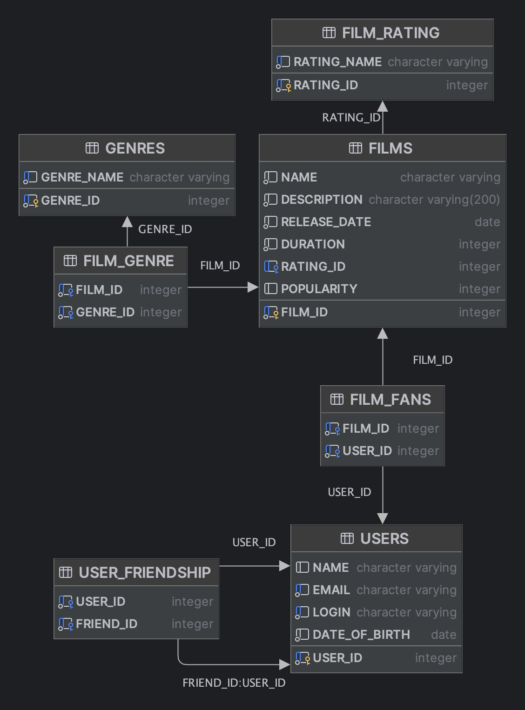

### О проекте

*Filmorate* - веб-приложение, где пользователи могут ставить оценки фильмам, добавлять их в избранное и выбирать фильмы на основе оценок других пользователей.

*Стек технологий*: Java, Maven, Spring Boot, JUnit, H2, Rest API, Lombok, JDBC Template.

Приложение имеет собственную базу данных, реализованную с помощью H2. 

**Диаграмма:**



**Список потенциальных запросов к БД:**
[Link](https://pastebin.com/fYic0hQJ)

### Функциональность: 

- показ топ лучших фильмов по версии пользователей;
- отображение фильмов по жанрам;
- разделение фильмов по рейтингу;
- хранение всех понравившихся пользователю фильмов;
- добавление в друзья других пользователей.

### Запуск приложения

Приложение поднимается c помощью фреймворка Spring Boot, при запуске автоматически подтянутся файлы data.sql и schema.sql.

Порядок запуска приложения:
1. *Клонирование репозитория*
```
git clone https://github.com/MaxGoodfella/Filmorate.git
cd Filmorate
```

2. *Запуск приложения через FilmorateApplication.java*

3. *Запуск коллекции запросов*

Коллекция postman-запросов доступна в папке postman. 
